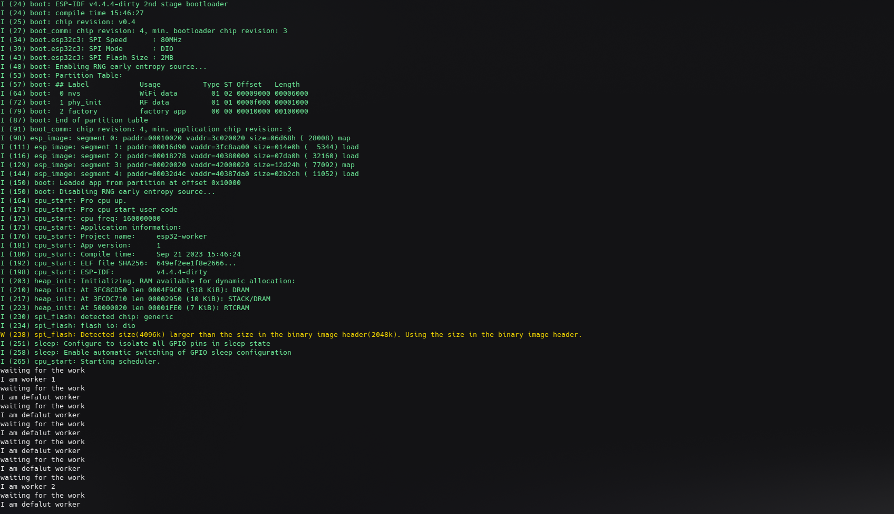

## Worker Queue in Freertos

This example shows the implementatino of the worker queue on freeRtos. Device first send the work 1 to the task, which is waiting for assigning any work. If no work has been associated within a given time frame it would execute the default work assigned. 

