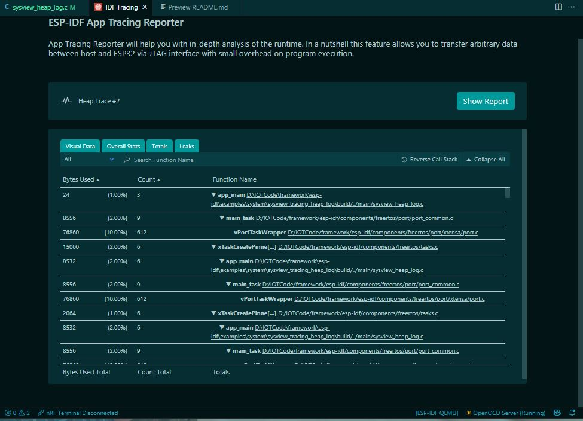

## Host Base memory tracing on esp -idf vscode extension

This example demonstrate that the host base debugging in the esp-idf framework. In this example we deliberately create the memory leak in the program. Then we use the jtag adapter(esp-prog) and get all the heap related information on the pc. This can ease out the esp which sometimes crashed in debugging due to memory issues.

After starting the heap trace in the esp -idf extension we get the file in the pc. After decoding the file we can generate the details regrading the heap in the system. Please checkout the screenshot below.

#### ESP crash due to the leak memory.

#### Here are the results of the host base tracing

