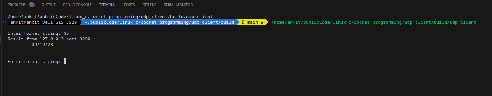

## UDP Client
This example connect to the  udp server on a given ip and port. It takes the formatted string from the stdin and send to the  sever. The server replied back the formatted time.

Ex output

